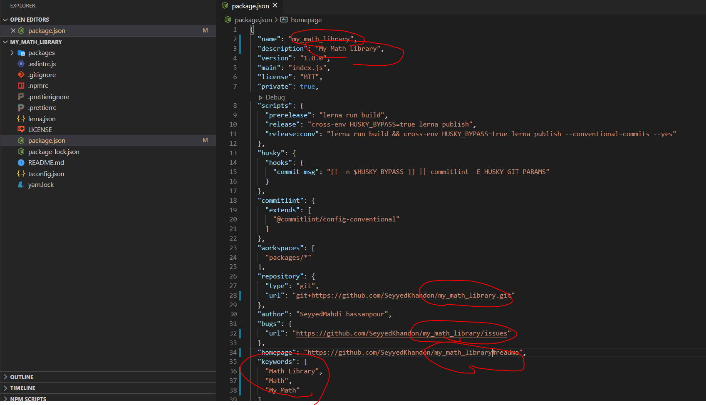
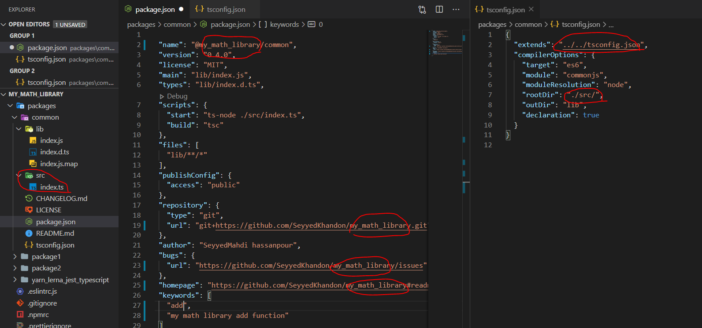
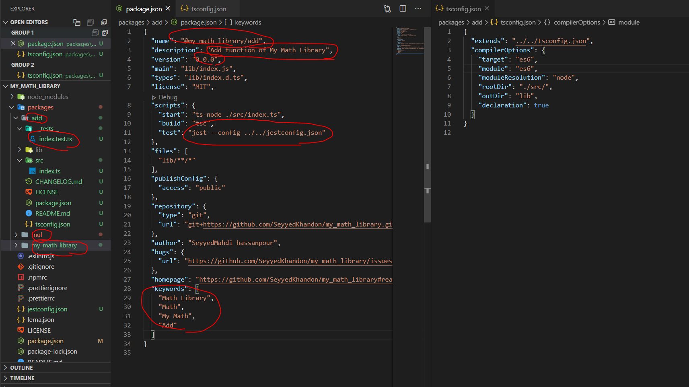
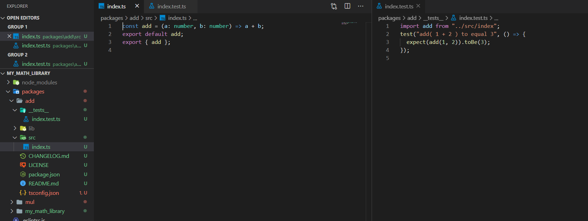
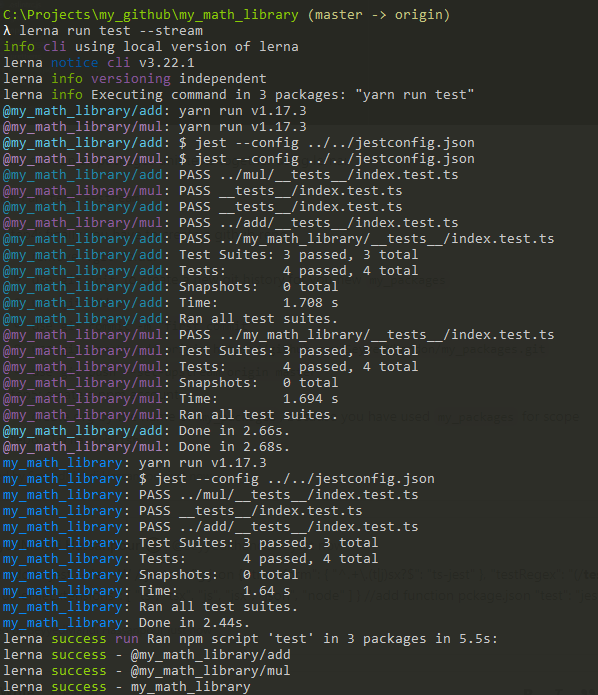
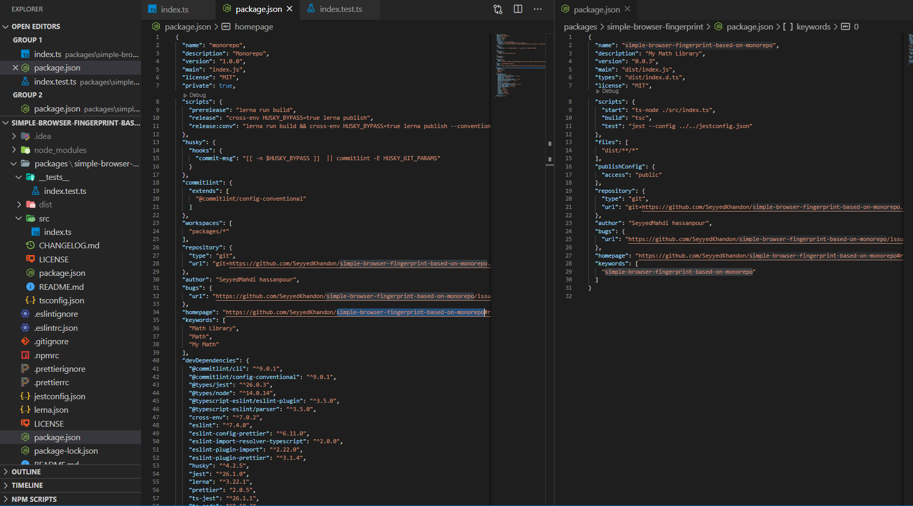

### package-publishing-using-lerna-yarn-jest-typescript

Package development and Publishing using lerna with yarn workspaces


#####Features List:

- [x] Lerna version manager
- [x] Yarn Workspaces
- [x] Typescript
- [x] Eslint(airbnb/browser)
- [x] Prettier
- [x] Jest unit test
- [x] Auto ChangeLog
- [x] Husky (Husky can prevent bad git commit, git push and more 🐶 woof!)

#####Todo List:

- [ ] tsconfig.build.json
- [ ] jest.config.js
- [ ] scss(use-follow instead of @import) 
- [ ] config .npmrc for Verdaccio


###How to use this:

**Readme.md:**

**Goal**

Library(Package) developing in a re-use-able and manage-able way with proper control on semantic versioning and git commit msg controlling, like react, lodash, babel, ..., and to be able import in such a way like below:

```
import add from "@mypackages/add";
import mul from "@mypackages/mul";
add(10,12);
mul(2,5)'

//or

import {add, mul} from "mypackages";
add(10,12);

//or 

import * as mypkg from "mypackages";
mypkg.add(10,12);

//or 

import mypkg from "mypackages";
mypkg.add(10,12);
```

**Solutions:**

1. create a package for each one, one for `add`, one for `mul`, etc..., then add the configuration for all of them (or simple copy/paste for all of them). so we can develop each package independently and it will work great in CDD(component driven development) manner.

> cons:
> 
> 1.The problem here is managing, versioning, testing each of them, and it will be much worse, when they have some dependency on each other, because if one of your teammate change package1 and if it were breaking changes, he/she has no idea where it have been used, so if the project use npm update, it will break the project since it has a package2 which used package1 and we didn't update it, since there  were no error on package's unit test.

> 2.We will end up with a lot of node_modules folder which is a redundant and bad thing for our HDD/SSD


2. **Mono-Repo**

> A Mono-Repo hosts one or more projects or packages. These packages are "Mini-Repos" that can be versioned, built, and published independently. Therefore, every package contains its own package.json file due to the fact that every package is a full-fledged project on its own. Packages might have dependency relations between each other. Managing these dependencies are implemented by symlinks. monorepo is a good practice which solve those issues in a really efficient way. we will using yarn and lerna to achieve a good monorepo.(there are some alternatives like bit.dev ,bolt,...)


> **Yarn workspaces** helps with the two issues:
> 
> It sets up a single node_modules without repetitions.So it manages our dependencies. Rather than having multiple node_modules directories, it intelligently optimizes the installing of dependencies together and allows for the cross-linking of dependencies in a monorepo.
> It allows you to change the code of one of your packages and have those changes instantly visible to the other packages that use it.

> **Lerna** makes versioning and publishing packages to an NPM Org a painless experience by providing helpful utility commands for handling the execution of tasks across multiple packages.


**Step by Step on How to use:**

- Step1. `git clone https://github.com/SeyyedKhandon/yarn_lerna_jest_typescript.git my_math_library && cd my_math_library`

consider that you should change all `yarn_lerna_jest_typescript` occurrences to what-ever scope you like, e.g `my_math_library`, so in this mini-tut, we will use my_math_library here as convention through this mini-tuts. you should see below structure, i have change some names to red circles which is:



**Note 1:** before going deep, i should tell you, we have used husky for bad git commit prevention(read it here https://www.conventionalcommits.org/en/v1.0.0/)

**Note 2:** we use tsconfig.json global here which has common configuration for all packages, and each package has its own which extend this global tsconfig for its own need.(for example to set their root dir to be a`src` folder in their own folder like below:)





- Step2. `yarn install`
- Step3: now you can remove package1/2  and create new packages based on these two samples.

I created 3 package `add,mul, my_math_library which contains two`:





**Note:** Default Package which has the name of the scope(my_math_library), is a simple code which includes all sub-packages which we want to access from 1 install `npm i my_math_library` or `yarn add my_math_library`  to get access like this:

```
import {add, mul} from "my_math_library";
add(10,12);
//or 
import * as mypkg from "my_math_library";
mypkg.add(10,12);
//or 
import mypkg from "my_math_library";
mypkg.add(10,12);
```
For this need we should install `add,mull` as dependencies for it, which we will use lerna for this purpose:

` lerna add @my_math_library/mul --scope=my_math_library`

` lerna add @my_math_library/add --scope=my_math_library`


Now we can run all packages unit tests together using lerna:

`lerna run test --stream`



- Step4: you have to create a github repo
    - remove `.git` folder
    - use `git init` to create a new git history for you new `my_math_library`
    - `yarn add husky --dev -W` to initialize husky for preventing bad git commit
    - use `git add .`
    - use `git commit -m "first commit" --no-verify"` Note: we added `--no-verify` for skip `husky` only for first commit
    - use `git remote add origin https://github.com/SeyyedKhandon/my_math_library.git`
    - use `git push -u origin master`
- Step5: create a npm account
    - create org by the name of `my_math_library`, because you have used `my_math_library` for scope
- Step6: `yarn release:conv`

this is an example which used this step by step guide to make a new monorepo for a math library:

https://github.com/SeyyedKhandon/my_math_library


**Note** 
Q1: Can i push my packages to local package management like verdaccio?

A1: Yes, you can, you should add the registery address to `.npmrc` file.

Q2: can i use it, if i have just one package? for example something like https://www.npmjs.com/package/simple-browser-fingerprint

A2: Yes, you can. your `packages/` folder will have just one package with your desired name as 
you can see in the below picture:

https://www.npmjs.com/package/simple-browser-fingerprint-based-on-monorepo




 
